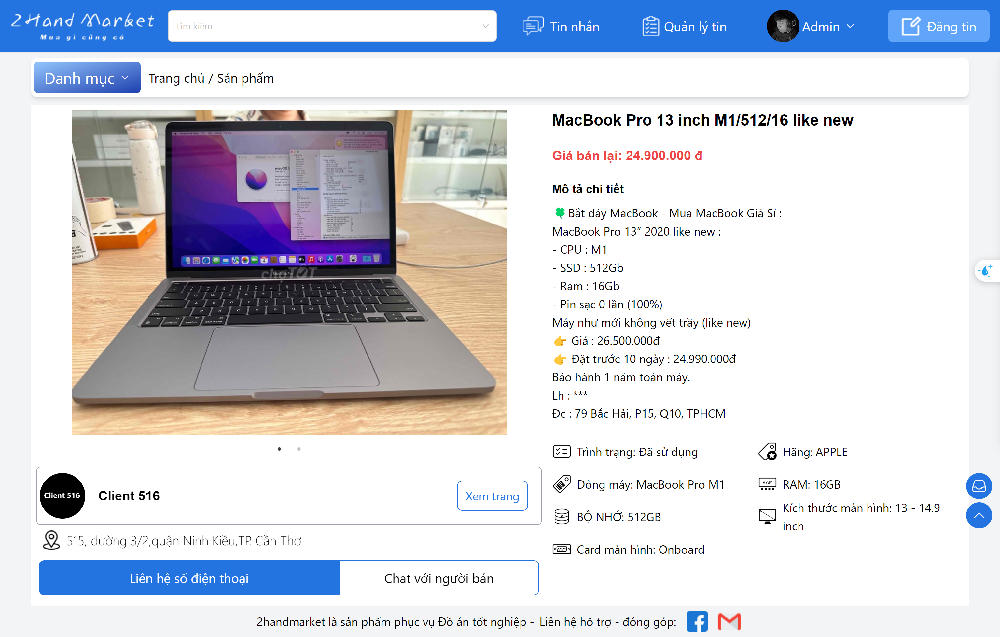
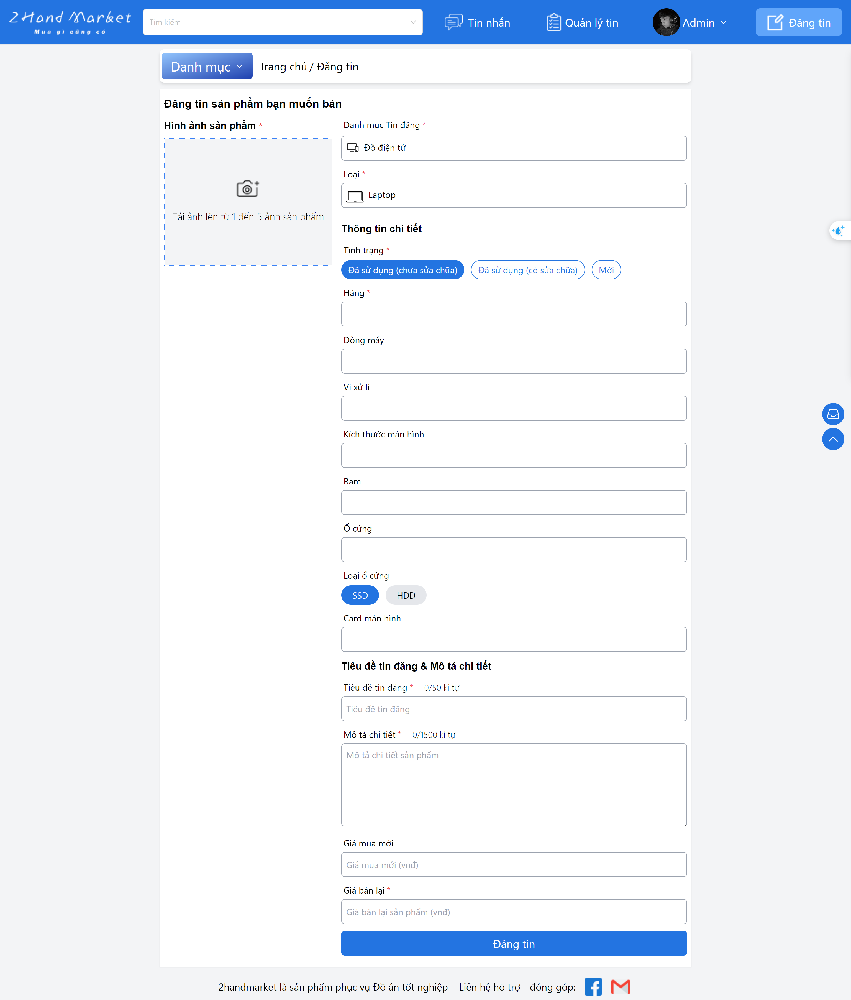
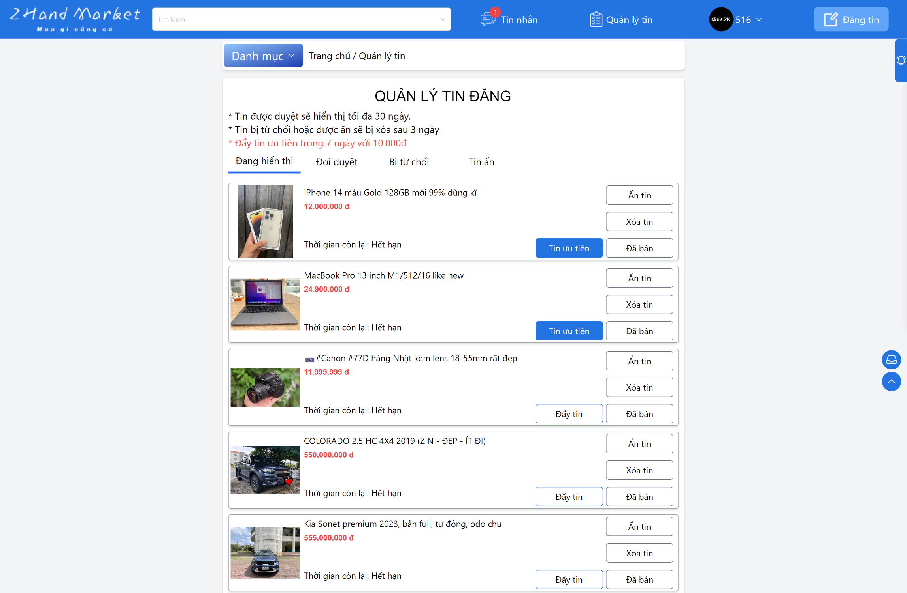
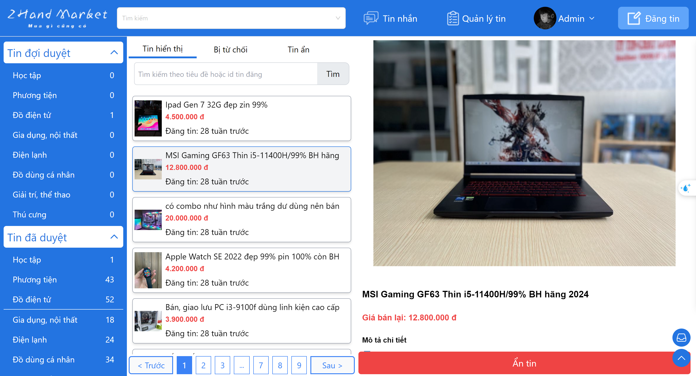
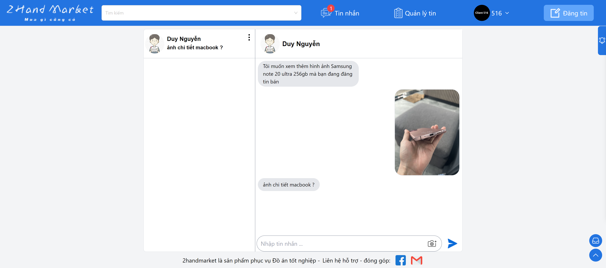

# Old Stuff Marketplace - Frontend Project

Welcome to the Old Stuff Marketplace project! This project is a frontend application built with Next.js and TailwindCSS. The platform allows users to buy, sell, and manage used items efficiently. Below is a comprehensive guide to help you get started and understand the project structure, features, and setup instructions.

_Account Demo:_

- **account:** demo | admin
- **password:** demodemo | admin

## Table of Contents

- [Features](#features)
- [Tech Stack](#tech-stack)
- [Screenshots](#screenshots)
- [Getting Started](#getting-started)
  - [Prerequisites](#prerequisites)
  - [Installation](#installation)
  - [Running the Application](#running-the-application)
- [Project Structure](#project-structure)
- [Usage](#usage)
  - [User Features](#user-features)
  - [Admin Features](#admin-features)
- [Configuration](#configuration)
- [Contributing](#contributing)
- [License](#license)

## Features

### User Features

- **Product Search:** Find products easily using the search functionality.
- **Product Categories:** Browse products by specific categories.
- **Product Details:** View detailed information about each product.
- **Post Ad:** Users can post their items for sale.
- **Authentication:**
  - Phone number verification for user registration.
  - Login with account credentials.
  - Login via Google and Facebook.
- **QR Code Payment:** Utilize MoMo QR code for ad payment.
- **Live Chat:** Integrated with Firestore for real-time chat.
- **Notifications:**
  - Status updates for posted ads.
  - Message notifications.

### Admin Features

- **Ad Approval:** Admins can approve or reject posted ads.
- **Ad Management:** Admins can manage all posted ads.
- **User Management:** Admins can manage user accounts.
- **Payment Management:** Handle ad payments and advertising fees.

## Tech Stack

- **Next.js:** React framework for server-side rendering and static site generation.
- **TailwindCSS:** Utility-first CSS framework for styling.
- **Firebase Firestore:** NoSQL database for real-time chat.
- **MoMo QR Code:** Payment gateway integration for ad payments.

## Screenshots

- **Homepage**


- **Detail post**



- **Create a post**



- **Manage post by User**



- **Manage post by Admin**



- **Message**



## Getting Started

### Prerequisites

- Node.js (v14.x or later)
- npm or yarn

### Installation

1. **Clone the repository:**
   ```
   git clone https://github.com/duynguyen1805/2handmarket.git
   cd 2handmarket
   ```
2. **Install dependencies:**
   ```
   npm install
   # or
   yarn install
   ```
3. **Install dependencies:**
   Create a .env.local file and configure the following environment variables:

   ```
   NEXT_PUBLIC_BACKEND_URL=your_backend_url
   NEXT_PUBLIC_JWT_SECRET=jsonwebtoken_secret_key
   NEXT_PUBLIC_GOOGLE_CLIENT_ID=your_client_id
   NEXT_PUBLIC_GOOGLE_CLIENT_SECRET=your_client_secret
   NEXT_PUBLIC_NEXTAUTH_SECRET=your_nextauth_secret
   NEXT_PUBLIC_FIREBASE_API_KEY=your_firebase_api_key
   NEXT_PUBLIC_FIREBASE_AUTH_DOMAIN=your_firebase_auth_domain
   NEXT_PUBLIC_FIREBASE_PROJECT_ID=your_firebase_project_id
   NEXT_PUBLIC_FIREBASE_STORAGE_BUCKET=your_firebase_storage_bucket
   NEXT_PUBLIC_FIREBASE_MESSAGING_SENDER_ID=your_firebase_messaging_sender_id
   NEXT_PUBLIC_FIREBASE_APP_ID=your_firebase_app_id
   NEXT_PUBLIC_MOMO_API_KEY=your_momo_api_key
   NEXT_PUBLIC_MOMO_PARTNER_CODE=your_momo_partner_code
   NEXT_PUBLIC_MOMO_ACCESS_KEY=your_momo_access_key
   ```

### Running the Application

    To start the development server:

    ```
    npm run dev
    # or
    yarn dev
    ```

Open http://localhost:3000 with your browser to see the result.

### Project Structure

```
fe_cho2hand/
├── components/ # Reusable UI components
├── pages/ # Next.js pages
│ ├── api/ # API routes
│ ├── admin/ # Admin dashboard pages
│ ├── auth/ # Authentication pages
│ └── ... # Other pages
├── redux/ # Manage states
├── service/ # Service routes call API Backend
├── public/ # Static assets
├── styles/ # Global styles and TailwindCSS configuration
├── utils/ # Utility functions
├── firebase.config.tsx/ # Firebase configuration and initialization
├── .env.local # Environment variables
├── next.config.js # Next.js configuration
├── tailwind.config.js # TailwindCSS configuration
└── package.json # Project metadata and scripts

```

### Usage

**User Features**

- Browse Products: Navigate through different categories to find desired items.
- Search Products: Use the search bar to quickly find specific products.
- View Product Details: Click on a product to see its details, including price, description, and seller information.
- Post an Ad: Log in and post your items for sale.
- Authentication: Register and log in using phone number verification or third-party providers (Google, Facebook).
- Live Chat: Communicate with sellers or buyers in real-time.
- Notifications: Receive updates about your posted ads and incoming messages.
- QR Code Payment: Utilize MoMo QR code for ad payment.
- Ad Promotion: Advertise posts by paying a fee via MoMo QR code.

**Admin Features**

- Approve Ads: Review and approve or reject new ads.
- Manage Ads: Edit or delete existing ads.
- Manage Users: View, edit, or delete user accounts.
- Handle Payments: Manage ad payments and advertising fees using MoMo QR code integration.

### Configuration

Customize your TailwindCSS setup by editing the tailwind.config.js file. Firebase settings can be modified in the firebase/ directory.

### Contributing

Contributions are welcome! Please fork the repository and submit a pull request for any feature additions, bug fixes, or improvements.
